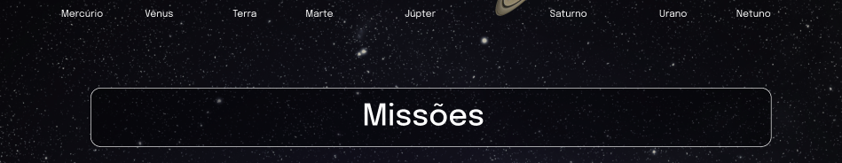

## 1. Crie um componente chamado `Header`

- Crie um componente chamado `Header` dentro da pasta `src/components`. Este componente irá renderizar o título principal da página.
- Ele deve conter uma tag `header` e, dentro dela, uma tag `h1`. O texto da tag `h1` deve ser "Sistema Solar".
- Renderize o componente `Header` dentro do componente principal `App`.


### O que será verificado

* Será validado se o componente `<Header />` é renderizado.

* Será validado se o componente `<Header />` contém uma tag `header`.

* Será validado se o componente `<Header />` contém uma tag `h1`.

* Será validado se o componente `<Header />` renderiza corretamente o texto "Sistema Solar".

* Será validado se o componente `<Header />` está sendo renderizado no componente principal `App`.

## 2. Crie um componente chamado `SolarSystem`

- Crie um componente chamado `SolarSystem` dentro da pasta `src/components`.
- Este componente deve ter uma `div` que envolva todo seu conteúdo e que tenha o atributo `data-testid="solar-system"`.
- Renderize o componente `SolarSystem` abaixo do `Header`, dentro do componente principal `App`.

### O que será verificado

* Será validado se o componente `<SolarSystem />` é renderizado.

* Será validado se existe uma `div` que possui o `data-testid="solar-system"`.

* Será validado se o componente `<SolarSystem />` está sendo renderizado no componente principal `App`.

## 3. Crie um componente chamado `Title`

- Crie um componente chamado `Title` dentro da pasta `src/components`.
- O componente `Title` deve receber uma prop `headline`.
- Ele deve conter uma tag `h2`, que deve renderizar o texto recebido pela prop `headline`.

### O que será verificado

* Será validado se o componente `<Title />` é renderizado.

* Será validado se o componente `<Title />` contém uma tag `h2`.

* Será validado se o componente `<Title />` renderiza o texto passado pela prop `headline` dentro de uma tag `h2`.


## 4. Renderize o componente `Title` dentro do componente `SolarSystem`

- Renderize o componente `Title` dentro do componente `SolarSystem`.
- O componente `Title` deve ser renderizado recebendo a prop `headline` com o valor "Planetas".


### O que será verificado

* Será validado se o texto "Planetas" é renderizado usando o componente `Title` dentro do componente `SolarSystem`.

## 5. Crie um componente chamado `PlanetCard`

- Crie um componente chamado `PlanetCard` dentro da pasta `src/components`.
- O componente `PlanetCard` deve receber duas props: uma chamada `planetName` e outra chamada `planetImage`.
- O componente `PlanetCard` deve ter uma `div` que envolva todo seu conteúdo e que tenha o atributo `data-testid="planet-card"`.
- O componente `PlanetCard` deve renderizar o texto recebido pela prop `planetName`. Sugerimos a utilização de tags de [Conteúdo de Fluxo](https://developer.mozilla.org/pt-BR/docs/Web/Guide/HTML/Content_categories#conte%C3%BAdo_de_fluxo), como `<p>`, que deve conter o atributo `data-testid="planet-name"`.
- O componente `PlanetCard` deve renderizar uma imagem que tenha o atributo `src` com o valor recebido pela prop `planetImage`.
- Além do atributo `src`, a imagem renderizada deve ter o atributo `alt` com o texto `Planeta {planetName}`, onde `{planetName}` é o valor recebido pela prop `planetName`.

### O que será verificado

* Será validado se o componente `<PlanetCard />` é renderizado.

* Será validado se o componente `<PlanetCard />` possui uma div com o atributo `data-testid="planet-card"`.

* Será validado se é renderizado o texto recebido pela prop `planetName`. 

* Será validado se é renderizada uma imagem com o atributo `src` com o mesmo valor recebido pela prop `planetImage`.

* Será validado se, além do atributo `src`, a imagem renderizada possui o atributo `alt` com o texto `Planeta {planetName}`, onde `{planetName}` é o valor recebido pela prop `planetName`.


## 6. Renderize uma lista com os planetas do Sistema Solar

- Renderize uma lista com os planetas do Sistema Solar dentro component `SolarSystem`.
- Utilize o componente `PlanetCard` para renderizar cada item da lista de planetas.
- Você encontrará a lista com os nomes e as imagens de cada planeta do Sistema Solar no arquivo `src/data/planets.js`.
- Você deve importar a lista no componente `SolarSystem` usando o código:
```javascript
import planets from '../data/planets';
```
- A lista de planetas é um _array_ de objetos no seguinte formato:
```javascript
{
  name: "Nome do planet",
  image: "caminho-para-imagem-do-planeta"
}
```
- Para cada planeta da lista, você deverá renderizar um componente `PlanetCard`, passando o atributo `name` para a prop `planetName` e o atributo `image` para a prop `planetImage`.

> :bulb: Dica: lembre-se do método que te permite criar vários componentes iguais a partir dos valores presentes em um array. Lembre-se que ao renderizar uma lista, você deve passar o atributo `key` para cada item. Você pode usar o nome do planeta como `key`.


### O que será verificado

* Será verificado se é renderizado um componente `<PlanetCard />` para cada planeta da lista de planetas.

* Será verificado se todos os planetas do Sistema Solar estão sendo listados na tela.


## 7. Crie um componente chamado `Missions`.

- Crie um componente chamado `Missions` dentro da pasta `src/components`.
- Este componente deve ter uma `div` que envolva todo seu conteúdo e que tenha o atributo `data-testid="missions"`.
- Renderize o componente `Missions` abaixo do `SolarSystem`, dentro do componente principal `App`.

### O que será verificado

* Será validado se o componente `<Missions />` é renderizado.

* Será validado se existe uma `div` que possui o `data-testid="missions"`.

* Será validado se o componente `<Missions />` está sendo renderizado no componente principal `App`.

## 8. Renderize o componente `Title` dentro do componente `Missions`.

- Renderize o componente `Title` dentro do componente `Missions`.
- O componente `Title` deve ser renderizado recebendo a prop `headline` com o valor "Missões"



### O que será verificado

* Será validado se o texto "Missões" é renderizado usando o componente `Title` dentro do componente `Missions`.

## 9. Crie um componente chamado `MissionCard`.

- Crie um componente chamado `MissionCard` dentro da pasta `src/components`.
- O componente `MissionCard` deve receber quatro props:
  - `name`
  - `year`
  - `country`
  - `destination`

- O componente `MissionCard` deve ter uma `div` que envolva todo seu conteúdo e que tenha o atributo `data-testid="mission-card"`.
- O componente `MissionCard` deve renderizar o texto recebido pela prop `name`. Sugerimos a utilização de tags de [Conteúdo de Fluxo](https://developer.mozilla.org/pt-BR/docs/Web/Guide/HTML/Content_categories#conte%C3%BAdo_de_fluxo), como `<p>`, que deve conter o atributo `data-testid="mission-name"`.
- O componente `MissionCard` deve renderizar o texto recebido pela prop `year`. Sugerimos a utilização de tags de [Conteúdo de Fluxo](https://developer.mozilla.org/pt-BR/docs/Web/Guide/HTML/Content_categories#conte%C3%BAdo_de_fluxo), como `<p>`, que deve conter o atributo `data-testid="mission-year"`.
- O componente `MissionCard` deve renderizar o texto recebido pela prop `country`. Sugerimos a utilização de tags de [Conteúdo de Fluxo](https://developer.mozilla.org/pt-BR/docs/Web/Guide/HTML/Content_categories#conte%C3%BAdo_de_fluxo), como `<p>`, que deve conter o atributo `data-testid="mission-country"`.
- O componente `MissionCard` deve renderizar o texto recebido pela prop `destination`. Sugerimos a utilização de tags de [Conteúdo de Fluxo](https://developer.mozilla.org/pt-BR/docs/Web/Guide/HTML/Content_categories#conte%C3%BAdo_de_fluxo), como `<p>`, que deve conter o atributo `data-testid="mission-destination"`.

### O que será verificado

* Será validado se o componente `<MissionCard />` é renderizado.

* Será validado se o componente `<MissionCard />` possui uma div com o atributo `data-testid="mission-card"`.

* Será validado se é renderizado o texto recebido pela prop `name`.

* Será validado se é renderizado o texto recebido pela prop `year`.

* Será validado se é renderizado o texto recebido pela prop `country`.

* Será validado se é renderizado o texto recebido pela prop `destination`. 


## 10. Renderize uma lista com as missões espaciais

- Renderize uma lista com as missões espaciais dentro componente `Missions`.
- Utilize o componente `MissionCard` para renderizar cada item da lista de missões.
- Você encontrará a lista com as informações de cada missão espacial no arquivo `src/data/missions.js`.
- Você deve importar a lista no componente `Missions` usando o código:
```javascript
import missions from '../data/missions';
```
- A lista de missões espaciais é um _array_ de objetos no seguinte formato:
```javascript
{
  name: 'Nome da missão',
  year: 'Ano de lançamento da missão',
  country: 'País que lançou a missão',
  destination: 'Destino da missão',
}
```
- Para cada missão espacial da lista, você deverá renderizar um componente `MissionCard`, passando o cada atributo para sua respectiva prop.

> :bulb: Dica: lembre-se do método que te permite criar vários componentes iguais a partir dos valores presentes em um array. Lembre-se que ao renderizar uma lista, você deve passar o atributo `key` para cada item. Você pode usar o nome da missão como `key`.


### O que será verificado

* Será verificado se é renderizado um componente `<MissionCard />` para cada missão espacial da lista de missões.

* Será verificado se todas as missões espaciais estão sendo listados na tela.
